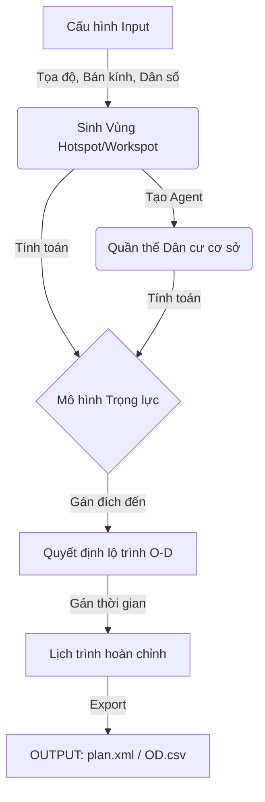

# 🏙️ MATSim Demand Generator - Dự án Tạo Nhu cầu Giao thông Giả định

Chào mừng bạn đến với dự án sinh dữ liệu plan cho MATSim. Tài liệu này được thiết kế để giúp bạn không chỉ chạy được code mà còn hiểu được **tư duy cốt lõi (logic flow)** đằng sau việc tạo ra các chuyến đi giả lập.

---

## 🧠 1. Tư duy Thiết kế (Mindset)
Để mô phỏng giao thông, câu hỏi lớn nhất là: **"Hàng ngàn người dân này đang đi đâu và tại sao?"**. Thay vì tạo dữ liệu ngẫu nhiên vô nghĩa, dự án này áp dụng các nguyên lý quy hoạch đô thị và toán học để sinh dữ liệu sát thực tế:

### Bước 1: Định hình Không gian (Spatial Logic)
Chúng ta không rải dân cư đều khắp bản đồ. Thay vào đó, ta định nghĩa các vùng tập trung:
-   **Hotspots (Vùng Dân cư)**: Nơi tập trung đông người sinh sống (ví dụ: khu chung cư, xóm dân cư).
-   **Workspots (Vùng Việc làm)**: Nơi tập trung nhu cầu lao động (ví dụ: khu công nghiệp, tòa nhà văn phòng).

### Bước 2: Tính toán "Sức hút" (Attractiveness)
Tại sao một khu vực việc làm lại thu hút lao động? Dự án này giả định:
> *Một Workspot hấp dẫn là nơi nằm ở vị trí đắc địa, gần các nguồn cung lao động (Hotspots) có mật độ dân số cao.*
-   **Thuật toán**: Sử dụng hàm mũ `exp` để tính điểm hấp dẫn. Càng gần khu đông dân, điểm càng cao.

### Bước 3: Mô hình Trọng lực (Gravity Model)
Khi một người (Agent) chọn nơi làm việc, họ sẽ cân nhắc:
1.  Độ hấp dẫn của nơi làm việc (Thuận).
2.  Khoảng cách từ nhà đến nơi làm việc (Nghịch).
> *Kết quả*: Người ta có xu hướng chọn việc làm ở nơi hấp dẫn nhưng không quá xa nhà. Code sử dụng công thức `Xác suất = Attractiveness / Distance` để gán đích đến cho từng người.

### Bước 4: Nhịp sống Đô thị (Temporal Logic)
Không ai đi làm vào lúc 3 giờ sáng. Hệ thống sẽ gán giờ xuất phát dựa trên **Giờ cao điểm (Peak Hours)**:
-   Sáng: Đi từ Nhà -> Chỗ làm.
-   Chiều: Đi từ Chỗ làm -> Nhà.

---

## 🌊 2. Luồng Dữ liệu (Data Flow)

Quy trình để code biến các con số cấu hình thành file `plan.xml` hoàn chỉnh:



1.  **Input**: Định nghĩa "Vùng X ở đâu, bao nhiêu dân?".
2.  **Scatter**: Rải ngẫu nhiên tọa độ nhà và chỗ làm trong các vùng đã định nghĩa.
3.  **Ranking**: Mỗi người dân sẽ "chấm điểm" tất cả các chỗ làm và chọn một nơi dựa trên xác suất.
4.  **Scheduling**: Gán giờ khởi hành ngẫu nhiên xoay quanh giờ cao điểm.
5.  **Output**: Ghi ra file XML chuẩn MATSim.

---

## 🔑 3. Các Thành phần Quan trọng
Để tạo ra một file Plan chất lượng, bạn cần kiểm soát 3 file chính trong mã nguồn:

1.  **`src/Main.py`** (Bộ não trung tâm):
    -   Tại đây bạn cấu hình danh sách `hotspot_configs` (Nguồn) và `workspot_configs` (Đích).
    -   *Quan trọng*: Bạn quyết định hình dáng vùng (`circle`/`rectangle`) và quy mô dân số (`pop`) tại đây.

2.  **`config/config.yaml`** (Đồng hồ thời gian):
    -   Quy định khung giờ cao điểm. Ví dụ: Rải chuyến đi tập trung vào 7h-9h sáng.

3.  **`src/demand/probability_destination.py`** (Trọng tài):
    -   Chứa logic quyết định "Ai đi đâu". Nếu bạn muốn thay đổi hành vi chọn việc (ví dụ: người ta thích đi làm xa hơn), hãy sửa công thức tại đây.

---

## 🚀 4. Hướng dẫn Sử dụng (Quick Start)

### Cài đặt
Cần Python 3.10+. Chạy lệnh sau để cài thư viện:
```bash
pip install -r requirements.txt
```

### Chạy Chương trình
Cách an toàn nhất để chạy (tránh lỗi import) là đứng từ thư mục gốc và gọi module:

```bash
# Windows / Linux / Mac
python -m src.Main
```

### Kết quả (Output)
Sau khi chạy xong, hãy kiểm tra thư mục `data/processed/`:
-   `plan.xml`: File quan trọng nhất, dùng để nạp vào MATSim.
-   `OD.csv`: Bảng thống kê luồng di chuyển (để vẽ biểu đồ hoặc phân tích trên Excel).
-   `complete_plan.csv`: Danh sách chi tiết từng người và lộ trình của họ.

---

## 📝 Ghi chú Kỹ thuật (Pro Tips)
-   **Tùy chỉnh Logic**: Hiện tại logic "độ hấp dẫn" đang nằm ở `src/computation/attractive.py`. Bạn có thể sửa hàm `calc_attractiveness_of_workspot` để thêm các yếu tố khác (ví dụ: lương cao, gần trung tâm thương mại...).
-   **Hiệu năng**: Nếu mô phỏng với số lượng dân cực lớn (>100k agent), quá trình tính toán Gravity Model có thể chậm. Hãy cân nhắc tối ưu vòng lặp trong `probability_destination.py`.

*© 2026 - Dự án v2_Tao_Plan_Da_Dang_Nhu_Cau*